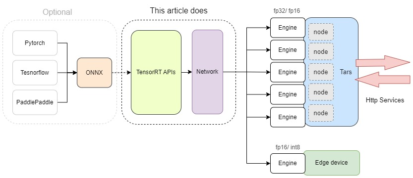
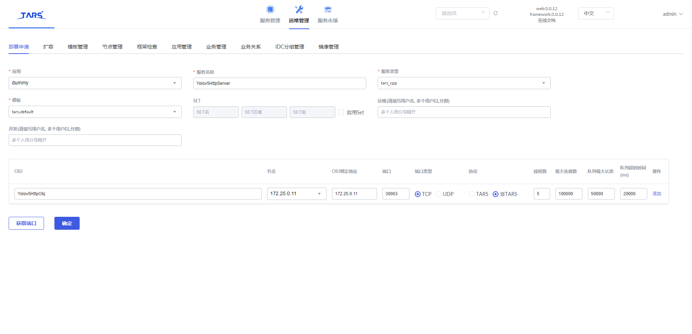
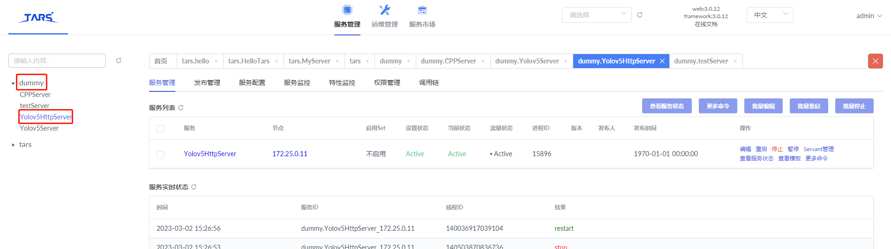
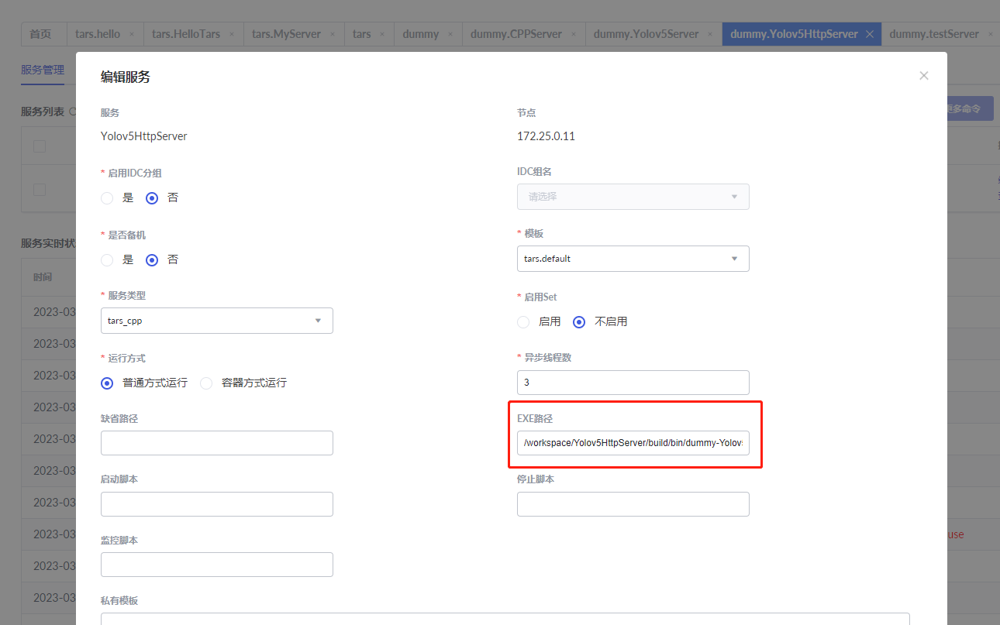

# An Example of Developing TensorRT C++ Model(Yolov5) Inference Service on Tars
## 流程

## 关于 Tars
### 1. What is Tars
是一款腾讯开发的基于名字服务使用 Tars 协议（或 Http 协议）的高性能 RPC 开发框架，配套一体化的运营管理平台，并通过伸缩调度，实现运维半托管服务。可以理解为以 C++ 开发的 Serverless 框架。  
[Tars Github](https://github.com/TarsCloud/Tars)

### 2. 为何选择 Tars
落地算法产品常会采用 Nvidia 的 TensorRT C++ 加速深度学习推理，安全关键型应用（如汽车）对深度学习模型的吞吐量和延迟有着严格的要求。非边缘端的模型推理需要封装成方法，为了能实现模型分布式部署达到负载均衡以应付大量请求，因此选择 Tars 作为 C++ 版本模型注册中心（Python 模型使用 [Nuclio](https://github.com/nuclio/nuclio) 注册部署）。

## 关于 TensorRT
### 1. Why Directly Build Network via TensorRT APIs
目前一般主流的模型权重和架构导出是直接从 TensorFlow、PyTorch 或 PaddlePaddle 加载权重后导出 onnx 文件，后续用 TensorRT 的 parser 将其解析成 TRT 版的网络，此种方法适用于较成熟的算法（2D检测/ 分割）。但新的算法可能采用特别的算子，容易导致无法正确转换，推理结果如果和 Python 版本不一样也不好排查。  
因此本文示例采用手搭网络的方式，某些不支持的算子（比如 Batch Normalization）使用 TensorRT 的 plugin API 实现，需要大量循环的预处理和后续里操作则用 CUDA 计算进一步提速。如此可以确保在推理精度一样的情况下，Python 和 C++ 版本的结果一致。

## Requirements
采用 conan 作为包管理工具
1. `cmake >= 3.0`
2. `conan == 1.59`  // 2.0版本会造成Json库编译问题
3. `docker`
4. `TarsCpp` (optional, 采用docker部署方式不需要) 安装参考 [TarsCpp GitHub](https://github.com/TarsCloud/TarsCpp)

## Tars Docker 安装/ 启动
TODO  
⚠️注意：为了让 Tars Node 能调用 CUDA，需使用自行构建的带 Nvidia CUDA 环境的 Docker 镜像，[willcy1006/tars:tars-node-cpp-cuda (DockerHub)](https://hub.docker.com/repository/docker/willcy1006/tars/general)。

## 编译 & 安装推理服务
### 1. 项目结构
```
-- model            模型推理目录
    -- plugin       算子插件
    -- src          推理相关
    -- config.json  模型参数配置文件
-- server
    -- include
        -- ConvertImage.h       图像/ 字符转换
        -- Yolov5Http.h         Tars 官方实现（自动生成）
        -- Yolov5HttpImp.h      具体业务逻辑
        -- Yolov5HttpServer.h   服务的实现类
    -- src
-- main.cpp      入口函数
-- conanfile.txt 依赖管理文件
```

### 2. 编译
```bash
conan profile update settings.compiler.libcxx=libstdc++11 default

# 安装 OpenCV 和 jsoncpp
conan install . -if cmake-build-debug -s build_type=Debug

mkdir build && cd build

# 会使用到 /usr/local/tars/cpp/makefile/tars-tools.cmake，需正确安装 TarsCpp
cmake .. -DCMAKE_TOOLCHAIN_FILE=../cmake-build-debug/conan_toolchain.cmake

make
```
生成的可执行文件路径为 `${PROJECT_DIR}/build/bin/dummy-Yolov5HttpServer`

## 服务注册
1. 部署申请
   - 打开 `{WEB_HOST:PORT}/tars.html#/operation/deploy` 进入运维管理->部署申请页面  
   - 填写各项数据，选择 ip 地址和端口号。服务类型为 `tars_cpp`，模板选择 `tars.default` 即可。注意协议部分需选择 `非TARS`，因为本示例为 `Http` 服务。


   - 📌Tars 中 APP/ Server/ Servant 的简单概念
      - APP：应用名，标识一组服务的一个小集合, 开发者可以根据需要自己定义, 通常表示实现某个业务系统名称。
      - Server: 服务名，提供服务的进程名称。
      - Servant: 服务提供者, 提供了一个多个具体的接口 (interface), 提供给客户端调用。**一个 Server 的 Servant 可以部署在多台机器上**。
2. 服务管理
   - 打开 `{WEB_HOST:PORT}/tars.html#/server` 选择服务管理栏
   - 左侧菜单树选择相应的 APP 名称和 Server 名称
   
   - 点击编辑按钮，将生成的可执行文件路径填入，点击重启即可
   

## 客户端测试
### 1. 同步模式
在 [client](client) 目录下提供了三种语言的客户端调用方式，请参考对应说明文档
- [Python](client/python/README.md)
- [JavaScript](client/javascript/README.md)
- [C++](client/cpp/README.md)

### 2. 异步模式
TODO